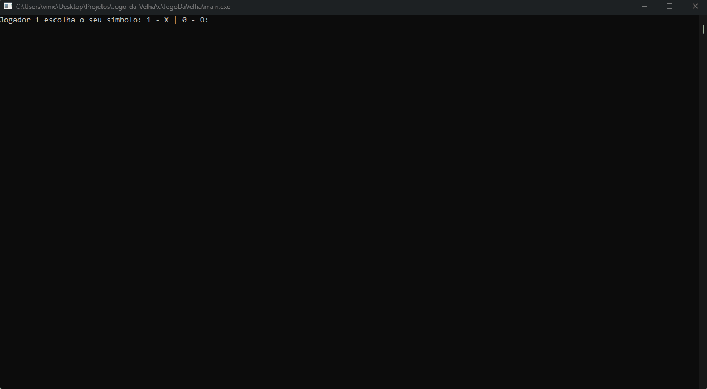

# Jogo da Velha em C
O projeto consiste em um jogo da velha implementado na linguagem C. O jogo da velha, também conhecido como Tic-Tac-Toe, é um jogo clássico jogado em um tabuleiro de 3x3, onde dois jogadores se enfrentam, alternando entre "X" e "O" em cada turno, com o objetivo de conseguir uma linha reta, horizontal, vertical ou diagonal preenchida com seus respectivos símbolos.

Na implementação em C, o programa irá exibir o tabuleiro na tela, utilizando caracteres para representar as posições ocupadas por cada jogador. Os jogadores poderão inserir sua escolha de posição através do teclado, sendo necessário validar se a posição escolhida é válida e se está disponível no tabuleiro. Após cada jogada, o programa verificará se houve um vencedor ou se o jogo resultou em empate.

### Projeto em C
Para jogar nesta versão do projeto, é necessário informar as coordenadas (x,y) da posição que deseja selecionar.

